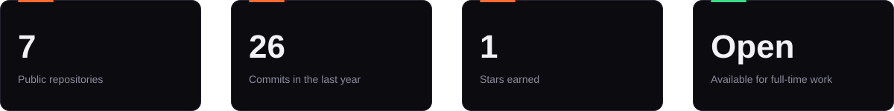

 

&nbsp;
&nbsp;
&nbsp;

 

## About

I'm a **Software Engineer Intern** in Sri Lanka, building business systems with **Laravel, React, and PostgreSQL**: admin dashboards, booking platforms, and internal tools.

Outside of work, I design and ship my own products end to end, across full-stack web, mobile, and applied AI/ML. I care about interfaces that feel considered, and backends that hold up once real users show up.

 

 

## Now

**Open to:** full-time software engineering roles, and freelance web and software projects.

 

## Featured Projects

| Project | Description | Stack | Link |
|---|---|---|---|
| **VPN App**    | Desktop VPN application, currently under active development | `Go` `Python` | Release coming soon |
| **Travio** | AI-driven travel planner with smart itineraries, an AR explorer, and a memories diary | `React Native` `Expo` `Supabase` | [Latest release](https://github.com/imantha3725/Travio/releases/latest) |
| **Traveller** | Android travel companion app | `Kotlin` | [Repo](https://github.com/imantha3725/Traveller) |
| **Clinic Management** | Full-featured clinic management system | `JavaScript` `React` | [Repo](https://github.com/imantha3725/clinic-management-web-app) |
| **Library Management** | Enterprise-grade library management system | `TypeScript` | [Repo](https://github.com/imantha3725/EAD_CW-Library-Management-System) |
| **Laravel CRUD** | Full CRUD application with clean MVC architecture | `PHP` `Laravel` | [Repo](https://github.com/imantha3725/Laravel-Crud-App) |

More projects and live demos at <a href="https://imanthasandirigama.me"><b>imanthasandirigama.me</b></a>

 

## Tech Stack

**Daily drivers** (what I use at work every day)

  

 

| | |
|---|---|
| **Languages** |        |
| **Frontend and mobile** |      |
| **Backend** |     |
| **AI and ML** |    |
| **Databases and cloud** |        |
| **Design and video** |    |
| **Exploring now** |   |

 

## Work with me

[Email](mailto:imanthasandirigama23@gmail.com) &nbsp;|&nbsp; [LinkedIn](https://www.linkedin.com/in/imantha-sandirigama-6554aa290/) &nbsp;|&nbsp; [Portfolio](https://imanthasandirigama.me)

